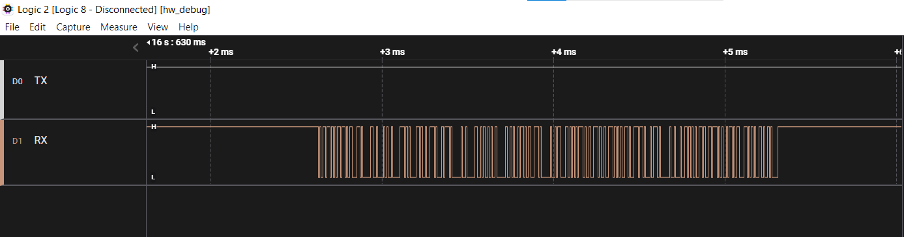
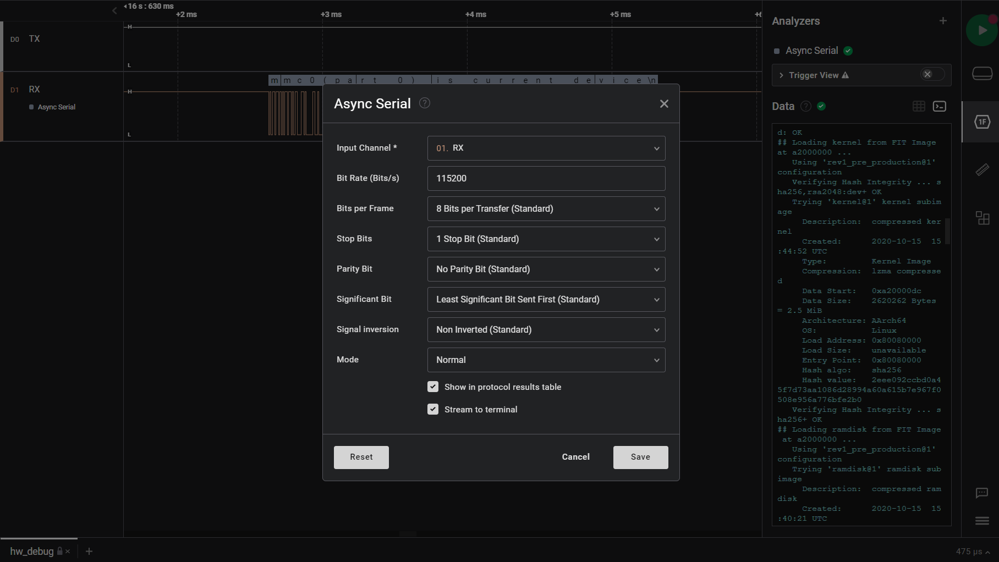
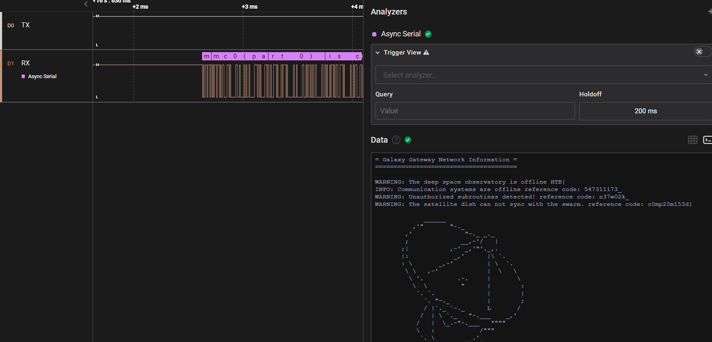

A writeup on Debug
<!--more-->


* **Given materials:** [Get it here!](https://drive.google.com/file/d/1wRpklHHBgr2vg_RjEyuSKXO9hFy5cbWn/view?usp=sharing)
* **Description:**
* **Category:** Hardware - Easy


## Problem statement

We received file with .sal extension - which contains a signal capture of a device. Our mission is identify which device is captured and how to decode the signal to decrypt the communication.

## Solution method

We use Logic 2 to open this file, then receive this:

There is only one channel with signals so probably we are talking about UART protocol. For doing that, first we have to calculate the baud rate (bit/s). To calculate the baud rate in this signal we zoom into the very first signal and see the minimun period of the signal. We can see that the smallest period between two high values is 8.68us. So, 1 bit need at least 8.68us to be transfered. The baud rate therefore must be around $1/8.68us \approx 115200$ (bit/s). Let's configure the analyzer with this value:

## Results
The flag is showed at the terminal, after correctly analyze the signal:

