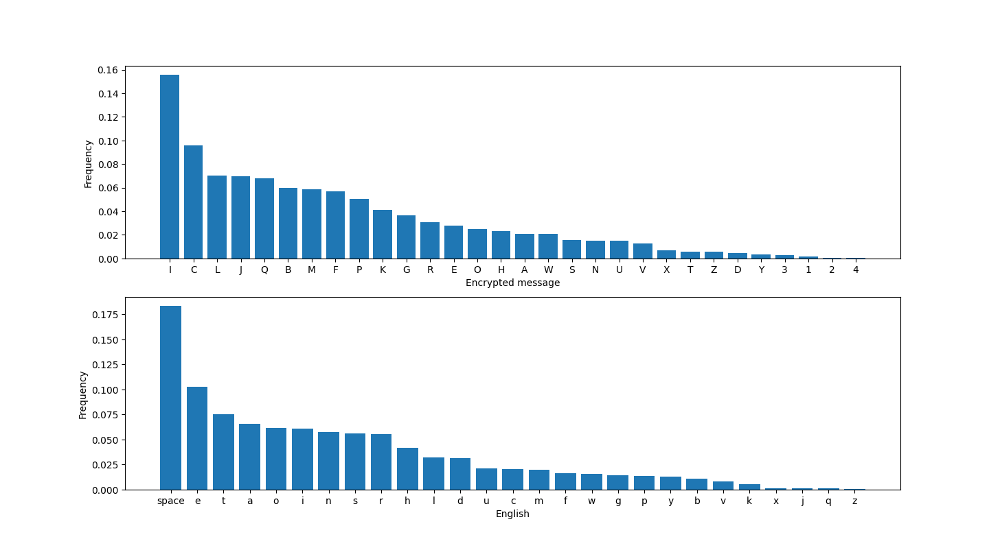

A writeup on Perfect Synchronization
<!--more-->


* **Given materials:** [Get it here!]()
* **Description:** The final stage of your initialization sequence is mastering cutting-edge technology tools that can be life-changing. One of these tools is quipqiup, an automated tool for frequency analysis and breaking substitution ciphers. This is the ultimate challenge, simulating the use of AES encryption to protect a message. Can you break it?
* **Category:** Crypto - Very Easy


The encyption script is shown below:

```python
from os import urandom
from Crypto.Cipher import AES
from secret import MESSAGE

assert all([x.isupper() or x in '{_} ' for x in MESSAGE])


class Cipher:

    def __init__(self):
        self.salt = urandom(15)
        key = urandom(16)
        self.cipher = AES.new(key, AES.MODE_ECB)

    def encrypt(self, message):
        return [self.cipher.encrypt(c.encode() + self.salt) for c in message]


def main():
    cipher = Cipher()
    encrypted = cipher.encrypt(MESSAGE)
    encrypted = "\n".join([c.hex() for c in encrypted])

    with open("output.txt", 'w+') as f:
        f.write(encrypted)


if __name__ == "__main__":
    main()
```
## Problem statement

The Python script defines a `Cipher` class that generates a random salt and key, then encrypts a message using AES in ECB mode. The encrypted message is written to a file in hexadecimal format. The `MESSAGE` variable is imported from a separate file. Our mission is to recover the encrypted message and find the flag in it. 

## Initial analysis

### The randomness
The author adds some randomnesses including `key` and `salt` to make the encryption more unpredictable. But if you look more closely into it, you will realize that the `salt` is just initialized once, and be padded for all characters in the message. It means the `salt` is not too much useful, it just shifts all characters by a constant value.

### The AES encryption mode
The author uses EBC mode - the weakest one, to encrypt all **shifted** characters of the message. 


For anyone who doesn't know about ECB: ECB (Electronic Codebook) is one of the simplest modes of AES encryption, where each block of plaintext is encrypted separately using the same key. In this mode, identical plaintext blocks will be encrypted to identical ciphertext blocks, making it vulnerable to attacks that exploit patterns in the plaintext. Therefore, ECB mode is not recommended for secure communication, and other modes like CBC, CTR, or GCM are preferred. A visualized example is illustrated in [this wiki](https://en.wikipedia.org/wiki/Block_cipher_mode_of_operation) to show that AES-ECB mode is not semantically secure.


### Just substitution
By the above analysis, we can prove that: 

For every $c_A, c_B \in \text{message}$: $c_A = c_B \Leftrightarrow ECB(c_A + \text{salt}) = ECB(c_B + \text{salt})$

This means the encryption is just a normal subsitution cipher. 

## Solution method

For simplicity in frequency analyzing, I map every different hex strings in the output file to a character (A-Z, 1-4), noted that identical strings would produce identical characters. By comparing to English Letter Frequency (including space character) table, we may recover some common letters like e, t, i, a, o confidentally. Then, by the reduncancy and meaning of English words, I can recover the entire content and find the flag.

## Results

After the mapping, here is the encrypted message:

ABCDECFGHIJFJKHLMLIMLINJLCOIPFIQRCIAJGQIQRJQIMFIJFHISMTCFILQBCQGRIPAIVBMQQCFIKJFSEJSCIGCBQJMFIKCQQCBLIJFOIGPUNMFJQMPFLIPAIKCQQCBLIPGGEBIVMQRITJBHMFSIABCDECFGMCLIUPBCPTCBIQRCBCIMLIJIGRJBJGQCBMLQMGIOMLQBMNEQMPFIPAIKCQQCBLIQRJQIMLIBPESRKHIQRCILJUCIAPBIJKUPLQIJKKILJUWKCLIPAIQRJQIKJFSEJSCIMFIGBHWQJFJKHLMLIABCDECFGHIJFJKHLMLIJKLPIXFPVFIJLIGPEFQMFSIKCQQCBLIMLIQRCILQEOHIPAIQRCIABCDECFGHIPAIKCQQCBLIPBISBPEWLIPAIKCQQCBLIMFIJIGMWRCBQCYQIQRCIUCQRPOIMLIELCOIJLIJFIJMOIQPINBCJXMFSIGKJLLMGJKIGMWRCBLIABCDECFGHIJFJKHLMLIBCDEMBCLIPFKHIJINJLMGIEFOCBLQJFOMFSIPAIQRCILQJQMLQMGLIPAIQRCIWKJMFQCYQIKJFSEJSCIJFOILPUCIWBPNKCUILPKTMFSILXMKKLIJFOIMAIWCBAPBUCOINHIRJFOIQPKCBJFGCIAPBICYQCFLMTCIKCQQCBINPPXXCCWMFSIOEBMFSIVPBKOIVJBIMMINPQRIQRCINBMQMLRIJFOIQRCIJUCBMGJFLIBCGBEMQCOIGPOCNBCJXCBLINHIWKJGMFSIGBPLLVPBOIWEZZKCLIMFIUJ1PBIFCVLWJWCBLIJFOIBEFFMFSIGPFQCLQLIAPBIVRPIGPEKOILPKTCIQRCUIQRCIAJLQCLQILCTCBJKIPAIQRCIGMWRCBLIELCOINHIQRCIJYMLIWPVCBLIVCBCINBCJXJNKCIELMFSIABCDECFGHIJFJKHLMLIAPBICYJUWKCILPUCIPAIQRCIGPFLEKJBIGMWRCBLIELCOINHIQRCI1JWJFCLCIUCGRJFMGJKIUCQRPOLIPAIKCQQCBIGPEFQMFSIJFOILQJQMLQMGJKIJFJKHLMLISCFCBJKKHIRQN2J3LMUWKC3LENLQMQEQMPF3ML3VCJX4IGJBOIQHWCIUJGRMFCBHIVCBCIAMBLQIELCOIMFIVPBKOIVJBIMMIWPLLMNKHINHIQRCIELIJBUHLILMLIQPOJHIQRCIRJBOIVPBXIPAIKCQQCBIGPEFQMFSIJFOIJFJKHLMLIRJLINCCFIBCWKJGCOINHIGPUWEQCBILPAQVJBCIVRMGRIGJFIGJBBHIPEQILEGRIJFJKHLMLIMFILCGPFOLIVMQRIUPOCBFIGPUWEQMFSIWPVCBIGKJLLMGJKIGMWRCBLIJBCIEFKMXCKHIQPIWBPTMOCIJFHIBCJKIWBPQCGQMPFIAPBIGPFAMOCFQMJKIOJQJIWEZZKCIWEZZKCIWEZZKC


Plotting the histogram of this encrypted message, comparing with the expected frequency, we get:


Here is the script, if you interested in:
```python
import matplotlib.pyplot as plt

def plot_histogram(text):
    english_freq = {'space': 0.18316895740067898, 'e': 0.10266650309881365, 't': 0.07516918822929543, 'a': 0.0653211522431101, 'o': 0.06165021261170107, 'i': 0.06109938076429621, 'n': 0.05748993391266301, 's': 0.0558094607431706, 'r': 0.05501226388301501, 'h': 0.0418265243918537, 'l': 0.03203162615518401, 'd': 0.03123691335535358, 'u': 0.02074798285524714, 'c': 0.020576050425919314, 'm': 0.019830666456506605, 'f': 0.016535714836861396, 'w': 0.015818636195592536, 'g': 0.014126275726274115, 'p': 0.01318902368984632, 'y': 0.012614330285168858, 'b': 0.010748157780246267, 'v': 0.007961080746834234, 'k': 0.005609987561400249, 'x': 0.0012367402118007968, 'j': 0.0010975645567653538, 'q': 0.0010065039671926798, 'z': 0.0005273232293542625}
    char_dict = {}
    for char in text:
        if char in char_dict:
            char_dict[char] += 1
        else:
            char_dict[char] = 1
    for key in char_dict:
        char_dict[key] /= len(text)
        # char_dict[key] *= 100
    char_dict = dict(sorted(char_dict.items(), key=lambda x: x[1], reverse=True))
    # plt.bar(char_dict.keys(), char_dict.values())
    fig, (ax1, ax2) = plt.subplots(nrows=2, ncols=1)

    # Plot the first subplot
    ax1.bar(char_dict.keys(), char_dict.values())
    ax1.set_xlabel('Encrypted message')
    ax1.set_ylabel('Frequency (%)')

    # Plot the second subplot
    ax2.bar(english_freq.keys(), english_freq.values())
    ax2.set_xlabel('English')
    ax2.set_ylabel('Frequency (%)')
    plt.show()
```

Based on the charts, we can easily find that letter `I`, `C` in encrypted message must be `space` and `e` in English, respectively. I guess there must be one and only one pair `{}` in the message for the flag `HTB{...}`. In the above chart, letter `2` and `4` share the smallest frequency, so they must be `{` and `}`. Moreover, the 3 characters immediately preceding `{` must be `htb`. After that, we got:


ABeDEeFGH JFJKHLML ML bJLeO PF the AJGt thJt MF JFH SMTeF LtBetGh PA VBMtteF KJFSEJSe GeBtJMF KetteBL JFO GPUbMFJtMPFL PA KetteBL PGGEB VMth TJBHMFS ABeDEeFGMeL UPBePTeB theBe ML J GhJBJGteBMLtMG OMLtBMbEtMPF PA KetteBL thJt ML BPEShKH the LJUe APB JKUPLt JKK LJUWKeL PA thJt KJFSEJSe MF GBHWtJFJKHLML ABeDEeFGH JFJKHLML JKLP XFPVF JL GPEFtMFS KetteBL ML the LtEOH PA the ABeDEeFGH PA KetteBL PB SBPEWL PA KetteBL MF J GMWheBteYt the UethPO ML ELeO JL JF JMO tP bBeJXMFS GKJLLMGJK GMWheBL ABeDEeFGH JFJKHLML BeDEMBeL PFKH J bJLMG EFOeBLtJFOMFS PA the LtJtMLtMGL PA the WKJMFteYt KJFSEJSe JFO LPUe WBPbKeU LPKTMFS LXMKKL JFO MA WeBAPBUeO bH hJFO tPKeBJFGe APB eYteFLMTe KetteB bPPXXeeWMFS OEBMFS VPBKO VJB MM bPth the bBMtMLh JFO the JUeBMGJFL BeGBEMteO GPOebBeJXeBL bH WKJGMFS GBPLLVPBO WEZZKeL MF UJ1PB FeVLWJWeBL JFO BEFFMFS GPFteLtL APB VhP GPEKO LPKTe theU the AJLteLt LeTeBJK PA the GMWheBL ELeO bH the JYML WPVeBL VeBe bBeJXJbKe ELMFS ABeDEeFGH JFJKHLML APB eYJUWKe LPUe PA the GPFLEKJB GMWheBL ELeO bH the 1JWJFeLe UeGhJFMGJK UethPOL PA KetteB GPEFtMFS JFO LtJtMLtMGJK JFJKHLML SeFeBJKKH htb{J3LMUWKe3LEbLtMtEtMPF3ML3VeJX} GJBO tHWe UJGhMFeBH VeBe AMBLt ELeO MF VPBKO VJB MM WPLLMbKH bH the EL JBUHL LML tPOJH the hJBO VPBX PA KetteB GPEFtMFS JFO JFJKHLML hJL beeF BeWKJGeO bH GPUWEteB LPAtVJBe VhMGh GJF GJBBH PEt LEGh JFJKHLML MF LeGPFOL VMth UPOeBF GPUWEtMFS WPVeB GKJLLMGJK GMWheBL JBe EFKMXeKH tP WBPTMOe JFH BeJK WBPteGtMPF APB GPFAMOeFtMJK OJtJ WEZZKe WEZZKe WEZZKe


The remaining task is to guess the words based on their meanings. Here is the result:


frequency analysis is based on the fact that in any giTen stretch of written language certain letters and combinations of letters occur with Tarying frequencies moreoTer there is a characteristic distribution of letters that is roughly the same for almost all samples of that language in cryptanalysis frequency analysis also tnown as counting letters is the study of the frequency of letters or groups of letters in a cipherteYt the method is used as an aid to breating classical ciphers frequency analysis requires only a basic understanding of the statistics of the plainteYt language and some problem solTing stills and if performed by hand tolerance for eYtensiTe letter bootteeping during world war ii both the british and the americans recruited codebreaters by placing crossword puZZles in ma1or newspapers and running contests for who could solTe them the fastest seTeral of the ciphers used by the aYis powers were breatable using frequency analysis for eYample some of the consular ciphers used by the 1apanese mechanical methods of letter counting and statistical analysis generally htb{a_simple_substitution_is_weat} card type machinery were first used in world war ii possibly by the us armys sis today the hard wort of letter counting and analysis has been replaced by computer software which can carry out such analysis in seconds with modern computing power classical ciphers are unlitely to proTide any real protection for confidential data puZZle puZZle puZZle      


The flag is: `HTB{a_simple_substitution_is_weat}`
## Conclusion

This challenge is just a substitution cipher, which is totally insecure against frequency analysis. The random key, salt, AES-ECB is just to make colors :D.  