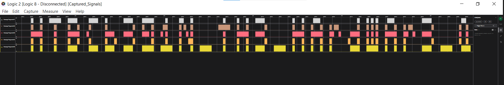

A writeup on Timed transmission
<!--more-->


* **Given materials:** [Get it here!](https://drive.google.com/file/d/1wMtr8Zv12tywaXRVWfli1s2YX6RREjdg/view?usp=sharing)
* **Description:**
* **Category:** Hardware - Very Easy


## Problem statement and results
What we have is a really strange file with .sal extension. I think the hardest part in this challenge is finding the app can open this file. After searching on Google (and chatgpt), I found a suitable app called Logic 2. Open the file and enjoy it :D 

