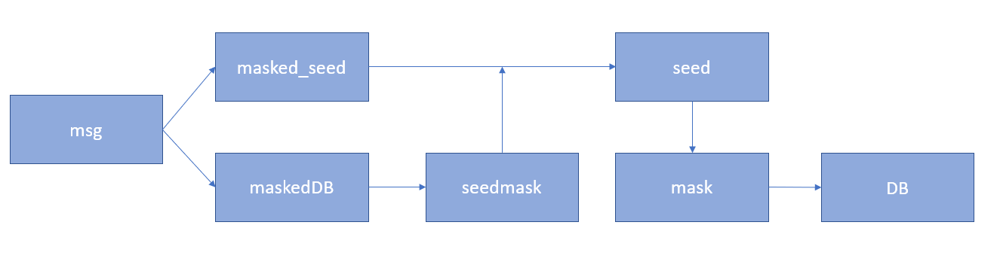

# nullcon HackIM CTF Berlin 2023: collector

A writeup on nullcon CTF 2023 - Collector
<!--more-->


* **Given materials:** [Get it here!](https://ctf.nullcon.net/files/ad34e47d2ea3b9c0105e3eb596a78983/collector.zip?token=eyJ1c2VyX2lkIjoxNDkyLCJ0ZWFtX2lkIjpudWxsLCJmaWxlX2lkIjo0Mn0.ZAq-Tw.gAvijOgKDno8j5MDVIwcJLuffGE)
* **Host:** 52.59.124.14:10005
* **Description:** Bob is hosting a party and invited everyone but me. But all the invitations I can collect are encrypted.
* **Category:** Crypto


The encyption code is shown below:

```python
from Crypto.PublicKey import RSA
from Crypto.Util.number import bytes_to_long, long_to_bytes
from hashlib import sha256
import random

from secret import flag

# Parameters
N = 2048
hLen = 256

def MGF(seed, length):
	random.seed(seed)
	return [random.randint(0,255) for _ in range(length)]

def pad(stream, bitlength, tag = b''):
	seed = sha256(stream).digest()
	DB = sha256(tag).digest() + b'\x00' * ((bitlength - 16 - 2*hLen) // 8 - len(stream)) + b'\x01' + stream
	mask = MGF(seed, len(DB))
	maskedDB = [DB[i] ^ mask[i] for i in range(len(DB))]
	seedmask = MGF(bytes_to_long(bytes(maskedDB)), hLen // 8)
	masked_seed = [seed[i] ^ seedmask[i] for i in range(hLen // 8)]
	EM = [0] + masked_seed + maskedDB
	return bytes(EM)

key = RSA.generate(N, e = (1<<(1<<random.randint(0,4))) + 1)
msg = pad(flag, N)
cipher = pow(bytes_to_long(msg), key.e, key.n)
print(key.publickey().export_key())
print(hex(cipher))
```

Every time we connect to the host (via netcat or sth), we will receive a different ciphertext encrypted by a random modulus and public key. Note that the message is not change. Our work is finding the message, then unpad it. 

The padding scheme is a little bit complicated. We will kill it later. At first we will retrieve the message.

## Find the message
Look at the randomization of public key `e = (1<<(1<<random.randint(0,4))) + 1`. This means `e` must be equal to $2^{2^x} + 1$ for some integers $x \in [0, 4]$. At some times `e` could be very small like 3 or 5. Because the message is unchanged, we can use the Chinese Remainder Theorem (CRT) to break this when gathering enough ciphertexts. I repeatedly connected to the remote until having 3 ciphertexts with `e = 3`. 

```python
e = 3
N = [28381641470468894491803213061106255342394785960384941880077041220424858882243977178327833510813856252123826746136803591828086299475087806054298840171844435617137577385214546313958620567553253217307660746834119848698440453807137028548358408609717898329618640526221733866656561521129647023240413028643353478087055828259789123943016979435211452647807696304538852270445595330922933463828624035948430989311305830380036909110401405096121447796742654166842393747308740780904196329123383973796349621094915042791540207331450449802592104266984813731468139429699360268971982017419995340593646178732193351256580686583645074686481, 28436672769421092594548202063747136916010694256439596421267256338356642110615214295636290262174422091110004588277589357833064734842830005906601043923191160888729742432170304483250917430300469828737729147336593221799075533669151807403536631518772213122496331705583686028383255398390202874974738970297256383620164410474840284541812020710089537740738125841696533411618103247902091800590243557503164318811200241072268218187996587800580083415291553258227269481299061378559085130925905173961445149171436522574889242127165031893466792518949839440702289685992727216675856642620509410556237355496471530737288787259785052322993, 25412404546346468305392035193378764251619897130524613049803135516536070315326552786305399441669596628056673371439515815781250907753718067067226518798529940898970567077537254185822862662220847912618660781287259157242149100209572603742637992436899975356747571153179206867731331643050831867936881069006927570181727198234072053231467970543502983704951535677566284955370022801304229992130157161656559459468967395896136014632983809461559912693283225883003846877844569910763540763884040047237999313928073272402379600504681309154175040711570175227656258694170595021901919042033878632991260113162504162300983314586289440358641]
c = [0xdfccaaeb5849c7e9b01d597255e1e77b3d6d441560e523074d024c79dfb61484c821c36e4f7ff4ca164cfd6112c904943a35926c7dffcd095567cf6421a027e83adcfa63be84a2407c5bd27d9e66679bb18d638cfb842301001ec0c760d455f376882f286b8f684a3b9270d4b9cd7288c21a983cb4364866e2553bacfd07b486a54fb0ea68f97c538aa83ec50074cb1d39277aa9976e6e29fbcc497ef1bcbea19029139c94f127c48092105f1fdd70cd007dfc70b853a999c6b1869573fdef7a53c1e2161734d13e3960a3c8b07f08098e2e197d2727cd6eadcc6b1132162ea4165c69f681bc30bf50fcfa98316ccddf4b2680d11017b53fd848899cac536476, 0x9c75253abd2f6112ccf8dc68b94a636dab7b97dbee4e827c458c53ef0ec07f88e9198c7c4c0bc2b12c045268dff6b7f4902315644112c80602fb234721cf17294bd5aac3bfac2260037bd1442198ad31b2654b8fdbf91df94cc18c761288e092a86f40abfa417a6ce29ef993a8454b001889f2b4fd3af240adb6ecdf18b1055ff1713b12a2163f6bf9421db1709863e5557354acd6cf4b806f9cb7252750a5654ba30da2a58e64c7116d7a97bdeb428cf1041e6506f989ee785313827ed054ba9da7064fcc1cdaf4550de966a1cf6a043d5870c80f182876e3cb78fb40ef1d90d32499c838e4f7da0b0fc0c3365384040eca1beb2879438f8aa6893439eb6241, 0x39d8ca6d816ae44c9c5785265ed276fc162e3c09d16a83398975af4b41e80e794acbb2ff2514b78d9de37933f89fc4df30f5eea0a58338d0b6390d72f33acd62587aec18b0a9f03627ae368b6f7c6243853084fe27f72cc3b7fd2eabee080cbb73d9bd561d566c2443aca2dadf0340d5cd69a7c18071c79345600239417ce8ec81b24b52b23f42e95e2d1c0cd40c9fb5b6c984ab7971a843f8d29cff2768f8df6b051d4f804bd858e6b8963c987dc39c9d03ef447b43991c4a6851e027b8479aa092e91b46803507a330915b71450b8e0e3714b92c1f8bc0b9b363de8565b48a68616f0aedf9e64b588828cff530c909dabf889decaead068de12aee635ad14e]
```

So we have $c_i$ sastifies $c_i \equiv \text{msg}^3 \text{ (mod }N_i)$ for $i = 0, 1, 2$.

Then using CRT to find $X$ that sastifies $X \equiv \text{msg}^3 \text{ (mod }N_0.N_1.N_2)$

```python
from sympy.ntheory.modular import crt
X = crt(N, c)[0]
# X = 114327365211462638783630957997053357739815907281310276341298451760344518930676671501926485178368245210315852500298627197206021282920674970430991780102198546374072738653038581574228025093043594960668159535998784903531800031268963088320198522590874009543712007963270249078921331261913709109858154932372039871156009745442600373424849725961072759171261911309683504125738525377843776036876594174009583169908361922660419415167323762722845160049617520288762100141415145810903796591678590997386492366364973605895884008097821769689766411487966503668759881741621753444680202015331188998364053296086880494603130250929559517281545278364760469696391115351714887782831080990922230423770374520502664588300325495535628763145518281722590004478049047040179988077087684451748737050756603713734981916476436851964830161999857363877537594824646013177748336091061885496764887657258423013090326843710118173884614691281026933128099622372456629837239741286083395449083280251421429557630687382398859582231971852719186348298119427748202928194739518214218497931861460297174123830337910967455983334766349150252435743473777788059353257425981625614535295405619699220864848999037701651696148752073424619477656931338671320480080018423390104139802178718558568179981594216065963564268811958921881188116276768209802984673837547936937932201234358280049568660441247868316670662897346626905389181707054434021632008147698587636701228505901679195988659810493062772671392639554616025205034063660505272784875602686512750757699649229119802081934288650392388025560338262525805764635994725349167416080318551292868966903094383084133113019646532651279684388918318134524420784593084139697974715157859848057587658092326037106892869856029556336373863414812587546857036724664331807743787147576750543209813351500106878436477258406177438779838494398649309644369314492084660540021137747204484083117
```

Because $\text{msg}$ often smaller than $N$, implies that $\text{msg}^3 < N_0.N_1.N_2$. It means $X$ is actually a cube of $\text{msg}$. Finding cube root is not a difficult thing.

Here is the code:
```python
from gmpy2 import iroot, mpz

msg = int(iroot(X, 3)[0])
print(msg)
```
Result:
```python
msg = 48534444686873161182574697497336314995656992153964328461894579635799174570722712541778100003911806341865825223329480115948469360443131218557724075361309533300378183123100075057498598100390824126471882247827056628640667808363839368575164770733553375958867511139975728748089626969562878340145431126308087978326782398491678767867040538037898739053133507896578097391480355355983172307219249891222712670624633243622636961127021032655734955592299536372338798068923968213925641445821911218460085435788525169065588374108336253789008257798862010532871464158651010248491177509558576872525747872221271356846282522071900724373
```
## Unpad the message
Although there're randomizations in this unpadding scheme, I quickly recognize that it allows me to set the seed, so the random function is not random anymore. We know the seed, we know all!

I will act like an amateur reverse engineer: just read what the code does and do reversely, hehe. For visualization, I've drawn a process of the reversing:



Here is my code:

```python
msg = long_to_bytes(msg)
msg = list(msg)
masked_seed = msg[1: 1 + (hLen//8)]
maskedDB = msg[1 + hLen//8:]
seedmask = MGF(bytes_to_long(bytes(maskedDB)), hLen // 8)
seed = [masked_seed[i] ^ seedmask[i] for i in range(hLen // 8)]
mask = MGF(bytes(seed), len(maskedDB))
DB = [maskedDB[i] ^ mask[i] for i in range(len(maskedDB))]
print(bytes(DB))
```
Unfortunately, it didn't work:
```
b"\xa2+\x14\x9e1\x8e\xa4\xb5h \xa8\x80\x9b?\xae\xe3\xe1L\xfc\xbb\x9cB_\xb3P\x19\xcb\xbfy\xe54'\xd2~\x98C \xcd\x03\xf0\xd3\x82K\x05\xfeT\xbc\xe4\xcc\xf5V6}\x1ds\xe9@)_o\xea\xd2\xbb\x00\x7f\xd9\xcd\xef5\xe3\x88\x00#p41\xc9wG\xdbKl\xd233\x83'\x13#\x1c\x97\xc1_\xd0xn\x0b\xd8p\x89_\xde\x98\xcb\xb0o\xd6J\xb8\x1cC\xad\xa2\x9bEe\x0f\xf1\x81\xfd\xa6G\xc7S\x1d&b\xe8\x0b5\xea\x10\x9av\x95\xe0\xa5t=\xdd^?\xa4.\x1cd\x0bm=\x8b\x0bS\x1aK\xff\xbf\xd1\x02\n\x82\xd4B\x17B*kBGP\xbfN\xd3C!\x01\x82\x05\xee_(\xd9m]\xd1^\x9bkF\xa0,\xe6\x17X\xc6\xee\x9a\xab\xa6\x96\xfd\x08\x16\xaf\xce\x89\xeb\xd8\x8av\xbb\xe0\xda\xe4\x00\xad\x08\xect\x87jE3"
```
That is because of the line `EM = [0] + masked_seed + maskedDB`. When we add prefix `0x00`, convert it to `long` and then convert it back to `bytes`, the prefix will gone.
```python
a = [0] + [5] + [7]
a = bytes(a)
print(a)
# b'\x00\x05\x07'
b = bytes_to_long(a)
print(long_to_bytes(b))
# b'\x05\x07'
```
So I add one null byte to my `msg` manually: `msg = [0] + list(msg)`. Here is the result after re-run the script:
```
b"\xe3\xb0\xc4B\x98\xfc\x1c\x14\x9a\xfb\xf4\xc8\x99o\xb9$'\xaeA\xe4d\x9b\x93L\xa4\x95\x99\x1bxR\xb8U\x00\x00\x00\x00\x00\x00\x00\x00\x00\x00\x00\x00\x00\x00\x00\x00\x00\x00\x00\x00\x00\x00\x00\x00\x00\x00\x00\x00\x00\x00\x00\x00\x00\x00\x00\x00\x00\x00\x00\x00\x00\x00\x00\x00\x00\x00\x00\x00\x00\x00\x00\x00\x00\x00\x00\x00\x00\x00\x00\x00\x00\x00\x00\x00\x00\x00\x00\x00\x00\x00\x00\x00\x00\x00\x00\x00\x00\x00\x00\x00\x00\x00\x00\x00\x00\x00\x00\x00\x00\x00\x00\x00\x00\x00\x00\x00\x00\x00\x00\x00\x00\x00\x00\x00\x00\x00\x00\x00\x00\x00\x00\x00\x00\x00\x00\x00\x00\x00\x00\x00\x00\x00\x00\x00\x00\x00\x00\x00\x00\x00\x00\x00\x00\x00\x00\x00\x00\x00\x00\x00\x00\x00\x00\x00\x00\x00\x00\x00\x00\x00\x01ENO{com3_to_Nu1lCon_bu1_do_n0t_tel1_B0b}"
```

The flag is at the end of this output: `ENO{com3_to_Nu1lCon_bu1_do_n0t_tel1_B0b}`
## Conclusion

This is an easy crypto challange, but consisting RE technique makes it valuable for me. 

---

> Author: [dasHaus165](https://haopham23.github.io/dashaus165blog/)  
> URL: https://haopham23.github.io/dashaus165blog/collector/  

