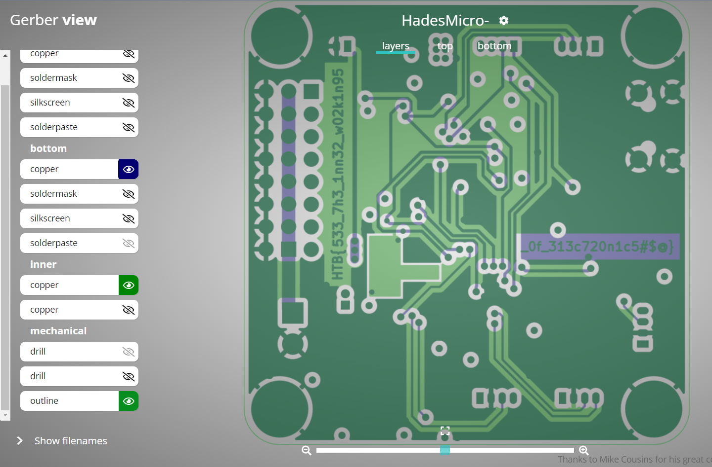

# Cyber Apocalypse 2023: Critical Flight

A writeup on Critical Flight
<!--more-->


* **Given materials:** [Get it here!](https://drive.google.com/file/d/1wPLpM6tLlZzncKIVRhR4YkUFW9G8EQl9/view?usp=sharing)
* **Description:**
* **Category:** Hardware - Very Easy


## Problem statement
Given a lot of GBR file. Our mission is somehow finding the flag :D. 

## Results
These files are called Gerber files - a standard file format used in the manufacturing of printed circuit boards (PCBs) to describe the PCB's copper layers, solder mask, legend, and other features. To open this, reader can access this website: [https://www.pcbway.com/project/OnlineGerberViewer.html](https://www.pcbway.com/project/OnlineGerberViewer.html). We can easily find all parts of the flag in this board:

---

> Author: [dasHaus165](https://haopham23.github.io/dashaus165blog/)  
> URL: https://haopham23.github.io/dashaus165blog/critical-flight/  

