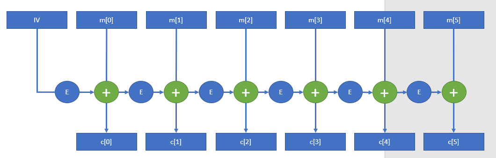
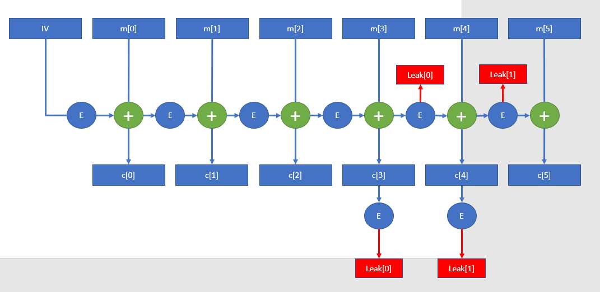

# Cyber Apocalypse 2023: Multipage Recyclings

A writeup on Multipage Recyclings
<!--more-->


* **Given materials:** [Get it here!](https://drive.google.com/file/d/1w-n16tVbL_eG-8XOvoMPJcfAEWQwxq-5/view?usp=sharing)
* **Description:** As your investigation progressed, a clue led you to a local bar where you met an undercover agent with valuable information. He spoke of a famous astronomy scientist who lived in the area and extensively studied the relic. The scientist wrote a book containing valuable insights on the relic's location, but encrypted it before he disappeared to keep it safe from malicious intent. The old man disclosed that the book was hidden in the scientist's house and revealed two phrases that the scientist rambled about before vanishing.
* **Category:** Crypto - Easy


The server script is shown below:

```python
from Crypto.Cipher import AES
from Crypto.Util.Padding import pad
import random, os

FLAG = b'HTB{??????????????????????}'


class CAES:

    def __init__(self):
        self.key = os.urandom(16)
        self.cipher = AES.new(self.key, AES.MODE_ECB)

    def blockify(self, message, size):
        return [message[i:i + size] for i in range(0, len(message), size)]

    def xor(self, a, b):
        return b''.join([bytes([_a ^ _b]) for _a, _b in zip(a, b)])

    def encrypt(self, message):
        iv = os.urandom(16)

        ciphertext = b''
        plaintext = iv

        blocks = self.blockify(message, 16)
        for block in blocks:
            ct = self.cipher.encrypt(plaintext)
            encrypted_block = self.xor(block, ct)
            ciphertext += encrypted_block
            plaintext = encrypted_block

        return ciphertext

    def leak(self, blocks):
        r = random.randint(0, len(blocks) - 2)
        leak = [self.cipher.encrypt(blocks[i]).hex() for i in [r, r + 1]]
        return r, leak


def main():
    aes = CAES()
    message = pad(FLAG * 4, 16)

    ciphertext = aes.encrypt(message)
    ciphertext_blocks = aes.blockify(ciphertext, 16)

    r, leak = aes.leak(ciphertext_blocks)

    with open('output.txt', 'w') as f:
        f.write(f'ct = {ciphertext.hex()}\nr = {r}\nphrases = {leak}\n')


if __name__ == "__main__":
    main()
```

We also have an output file:
```python
ct = bc9bc77a809b7f618522d36ef7765e1cad359eef39f0eaa5dc5d85f3ab249e788c9bc36e11d72eee281d1a645027bd96a363c0e24efc6b5caa552b2df4979a5ad41e405576d415a5272ba730e27c593eb2c725031a52b7aa92df4c4e26f116c631630b5d23f11775804a688e5e4d5624
r = 3
phrases = ['8b6973611d8b62941043f85cd1483244', 'cf8f71416111f1e8cdee791151c222ad']
```

## Problem statement
This code defines a class called `CAES` that implements the AES encryption algorithm in ECB mode. The `CAES` class has methods to `blockify` a message into 16-byte blocks, `xor` two byte arrays, and `encrypt` a message using AES in ECB mode. Additionally, it has a method called `leak` that generates a random integer `r` and returns the encryption of two randomly chosen adjacent 16-byte blocks. The `main` function of this code creates an instance of the CAES class, generates a message by padded `FLAG*4`, encrypts the message, and generates a leak using the `leak` method of the `CAES` class. Finally, the main function writes the `ciphertext`, the randomly chosen integer `r`, and the `leak` to a file called `output.txt`.


## Initial analysis
### The encryption method
The `encrypt()` method is not in ECB mode, it's similar to CBC, which can be visualized by this graph:


### The leaked data
The `leak` method extracts 2 consecutives blocks of **ciphertext** and encrypted them using ECB mode. Our leaked data is of ciphertext block 3th and 4th. By using the graph above, we can easily see where the leak data comes from and how to use it to break the system, here is the new graph:


## Solution method
The work is simple, just to xor the `c[4]` with `Leak[0]` and xor `c[5]` with `Leak[1]`, then we can recover the plaintext `m[4]` and `m[5]`, respectively. They must be parts of, or entire flag (in any order).

Here is the script:
```python
def xor(a, b):
    return b''.join([bytes([_a ^ _b]) for _a, _b in zip(a, b)])

def blockify(message, size):
    return [message[i:i + size] for i in range(0, len(message), size)]
ct = 'bc9bc77a809b7f618522d36ef7765e1cad359eef39f0eaa5dc5d85f3ab249e788c9bc36e11d72eee281d1a645027bd96a363c0e24efc6b5caa552b2df4979a5ad41e405576d415a5272ba730e27c593eb2c725031a52b7aa92df4c4e26f116c631630b5d23f11775804a688e5e4d5624'
r = 3
Leak = ['8b6973611d8b62941043f85cd1483244', 'cf8f71416111f1e8cdee791151c222ad']
Leak = [bytes.fromhex(x) for x in Leak]
c = blockify(ct, 32)

c = [bytes.fromhex(x) for x in c]
print(xor(c[4], Leak[0]) + xor(c[5], Leak[1]))
```
## Results
Here is the result: `b'_w34k_w17h_l34kz}HTB{CFB_15_w34k'`

Then the final flag would be: `HTB{CFB_15_w34k_w34k_w17h_l34kz}`


---

> Author: [dasHaus165](https://haopham23.github.io/dashaus165blog/)  
> URL: https://haopham23.github.io/dashaus165blog/multipage-recyclings/  

